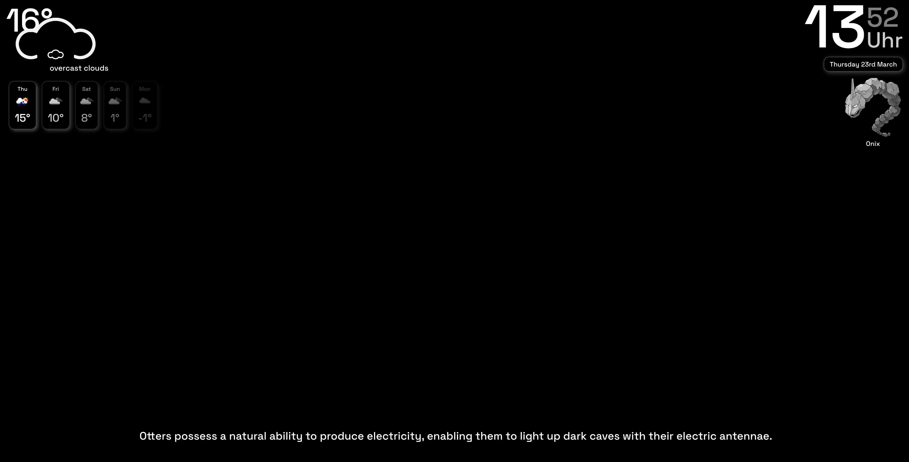

# Smart Mirror Application

Client and Server MERN Stack Application which is made to run on a DIY Smart Mirror.

## Features

- OpenAI language model integration
- Docker
- Node express
- MongoDB
- React
- PokeAPI & OpenWeatherAPI

